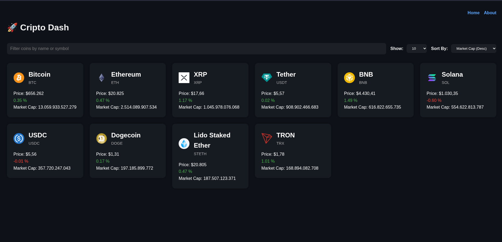

# 💹 Crypto Dash

Crypto Dash is a modern, responsive cryptocurrency dashboard built with React. It fetches real-time data from a public API and provides users with an intuitive interface to explore live crypto prices, charts, and key market metrics.

<p align="center">
  
</p>

## ✨ Features
- ⚡ Live Price Tracking – Displays real-time cryptocurrency prices, market cap, and percentage changes.
- 📈 Interactive Chart – Visualize 7-day price history for each coin using dynamic line charts.
- 🔍 Search & Filter – Instantly filter cryptocurrencies by name or symbol.
- 🧮 Sorting Options – Sort coins by market cap, price, and more.
- 📊 Detailed Coin Pages – Click any coin to see full market details, including 24h high/low, rank, and historical chart.
- 🎨 Responsive Dark UI – Built with a sleek, dark-themed, mobile-friendly design.

## 🛠️ Tech Stack
- React – UI rendering and component architecture
- Charts.js – Data visualization (charts)
- Fetch API – HTTP requests to fetch live data
- CSS Modules
- CoinGecko API – Data source

##  🚀 How to Run
```bash
git clone https://github.com/gotneb/crypto-dash.git
cd crypto-dash
npm install
npm start
```
